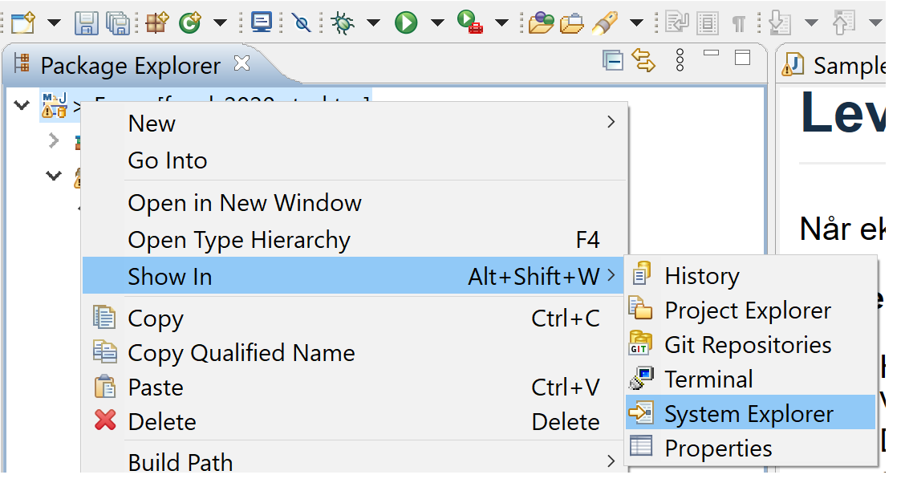

# Kontinuasjonseksamen TDT4100 høsten 2020

Eksamenen er delt i to, med flere oppgaver i hver del:

- [Del 1](src/main/java/stuff/README.md) inneholder separate oppgaver, som hver for seg tester ulik kunnskap i pensum. Del 1 er tenkt å dekke 40% av eksamen.
- [Del 2](src/main/java/food/README.md) inneholder en større programmeringsbit, med fire deloppgaver. Disse teller 60% av eksamen.

Hvis du ikke skulle klare å implementere en metode i en del kan du selvfølgelig bruke denne videre som om den virket (som i tidligere 'papireksamener'). 

Oppgavene har en tekstbeskrivelse, men denne er ikke alltid utfyllende. De mest utfyllende kravene til en metode står i dens javadoc-beskrivelse, altså en kommentar som står før metoden selv i kildekoden. Mange av metodene har fått lagt til 'dummy' returverdier - dette er gjort slik at kildekoden vil kompilere. Disse må naturlig nok endres for at metodene skal fungere som beskrevet.

## Levering
Når eksamen skal leveres kan du gjøre dette på denne måten:

**Zippe i Windows**

- Høyreklikk på prosjektikonet i 'Package Explorer' helt til venstre i Eclipse.
- Velg 'Show in' -> click 'System Explorer'.
- Du skal nå få opp et utforskervindu (ikke i Eclipse, men i Windows) som står åpent i en folder som sannsynligvis slutter på git. For meg er det _'C:\Users\borgeha\git'_ Denne folderen inneholder prosjektfolderen vi skal komprimere.
- Høyreklikk prosjektfolderen, den skal hete kont2020 -> meny 'Send til' -> 'Komprimert (zippet) mappe'. 
- Windows komprimerer nå prosjektfolderen kont2020, og spør deg hva den skal kalles La den hete det som foreslås.
- Denne zipfilen er filen dere skal laste opp til Inspera til slutt.
- Dere finner et par bilder av prosessen til slutt i denne filen.

**Zippe i OS X**

- Følg instruksjonene som for Windows overfor, men ting har andre navn.
- Høyreklikk prosjektet i Eclipse -> 'Åpne i Finder'
- Høyreklikk prosjektfolderen og velg 'Komprimer'
- Filen du får er den som skal lastes opp til Inspera.

**System Explorer**

**Compress**

